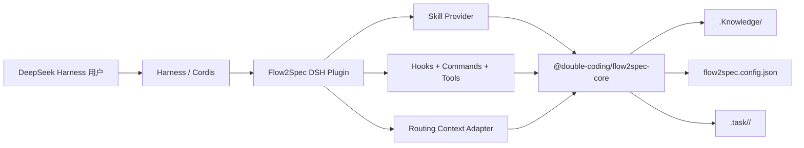

# Flow2Spec DeepSeek Harness 原生插件技术方案

## 需求概述

### 背景

Flow2Spec 已通过 `flow2spec init dsh` 支持 DeepSeek Harness 的项目级配置，能够把 Skills、规则镜像和知识库入口写入目标仓库。该方式仍要求用户理解并执行 npm CLI 初始化流程，也无法使用 Harness 原生插件提供的生命周期、Skill Provider、命令和事件扩展能力。

本项目建设独立的 DeepSeek Harness 原生插件。DeepSeek Harness 用户只需安装并启用插件，即可使用 Flow2Spec；Flow2Spec CLI 与其他开发工具的既有接入方式保持不变。

### 目标

- 发布独立 npm 包 `@double-coding/flow2spec-deepseek-harness`。
- 以 `@double-coding/flow2spec-core` 为唯一业务能力来源，不在插件仓复制知识引擎、初始化器或 Skills 正文。
- 通过 Cordis 原生插件注册 Skill Provider、命令、工具和生命周期 Hook。
- 首次使用时自动建立 `.Knowledge/`、`flow2spec.config.json`、`.gitignore` 等项目基线，用户无需执行 `npx flow2spec init`。
- 覆盖 Flow2Spec Core 当前全部能力：项目初始化、配置、知识路由、知识变更、协作身份、Doctor、资源读取和版本检查。
- 支持已有 `flow2spec init dsh` 项目平滑迁移，保留业务知识和用户自定义内容。
- 对 DeepSeek Harness 开发者预览版采用明确的版本锁定、兼容性检测和发布门禁。

### 范围外

- 不把 Flow2Spec Core 搬入插件仓或维护第二份 Skills。
- 不改变 Cursor、Claude Code、Codex 等现有用户的 CLI 使用方式。
- 不在首个正式版增加独立 Web 管理页面；现有能力通过 Harness 原生命令、工具结果和日志呈现即可完整使用。
- 不自动删除 `.Knowledge/`、`flow2spec.config.json`、`.task/` 或用户已有的 `.dsh/` 内容。
- 不假设尚未进入官方文档的插件市场或一键安装命令；分发流程只使用发布时已验证的 Harness 官方加载机制。

## 技术基线

本方案在 2026-08-17 以以下版本和官方资料为基线：

| 组件 | 基线 | 用途 |
| --- | --- | --- |
| DeepSeek Harness CLI | `@deepseek-ai/dsh@0.1.0-rc.6` | 集成与端到端验证宿主 |
| DeepSeek Harness 源码 | `master@47f943859bef60e4160492346772ded9b24f765a` | 官方插件、事件和配置契约快照 |
| Cordis | `@deepseek-ai/cordis@4.0.1` | 插件生命周期与依赖注入 |
| DSH Skill | `@deepseek-ai/dsh-skill@0.1.0-rc.6` | Skill Provider 类型 |
| DSH Commands | `@deepseek-ai/dsh-commands@0.1.0-rc.6` | 人类命令注册 |
| DSH System Prompt | `@deepseek-ai/dsh-system-prompt@0.1.0-rc.6` | 动态路由上下文注入 |
| Flow2Spec Core | `@double-coding/flow2spec-core@3.3.1` | 当前能力基线；插件开发前按下文补充公共契约 |
| Node.js | `^22.19.0 || >=24.0.0` | 与 Harness 当前引擎要求一致 |

官方依据：

- [DeepSeek Harness 插件入门](https://github.com/deepseek-ai/deepseek-harness/blob/master/docs/user/develop/basic/index.md)
- [Skills 子系统](https://github.com/deepseek-ai/deepseek-harness/blob/master/docs/subsystems/skills.md)
- [Commands 子系统](https://github.com/deepseek-ai/deepseek-harness/blob/master/docs/subsystems/commands.md)
- [System Prompt 子系统](https://github.com/deepseek-ai/deepseek-harness/blob/master/docs/subsystems/system-prompt.md)
- [Cordis 生命周期](https://github.com/deepseek-ai/deepseek-harness/blob/master/docs/cordis-tutorial/02-lifecycle-and-effects.md)
- [Extension Cookbook](https://github.com/deepseek-ai/deepseek-harness/blob/master/docs/cookbook/extension-cookbook.md)

DeepSeek Harness 仍处于开发者预览阶段。每次升级宿主依赖时，必须重新锁定官方源码提交并运行完整兼容性测试，不能仅依赖 semver 范围推断兼容。

## 架构与职责边界



### Flow2Spec Core

Core 是跨宿主共享的唯一事实源，负责：

- 初始化和增量维护项目基线。
- 读取、校验并解释 `flow2spec.config.json`。
- `match -> expand -> verify -> loadContext` 知识路由。
- `status/check/plan/apply/build` 知识引擎。
- `developerId` 与 `TASK_ROOT` 解析。
- Doctor 检查。
- Skills、规则、模板和能力清单资源。

### DeepSeek Harness 插件

插件只负责宿主适配：

- 将 Core Skills 转换为 DSH `SkillCandidate` / `SkillDefinition`。
- 将 Core 的项目、路由、知识和 Doctor API 映射为 DSH 命令与工具。
- 在 Harness 生命周期中调用 Core，并把结果注入当前 Agent 上下文。
- 管理 DSH 依赖、配置、日志、缓存、取消信号和卸载清理。
- 处理 DSH 版本兼容性，不修改 Core 的业务语义。

### 项目数据

项目数据继续使用 Flow2Spec 的既有契约：

| 路径 | 所有者 | 生命周期 |
| --- | --- | --- |
| `.Knowledge/` | 团队共享 | 进入 Git，插件卸载后保留 |
| `flow2spec.config.json` | 项目共享配置 | 进入 Git，插件卸载后保留 |
| `.task/<developerId>/` | 开发者个人过程状态 | 默认由 `.gitignore` 忽略 |
| `.dsh/skills/` | 旧项目级适配产物或用户自定义内容 | 兼容读取，不由插件强制删除 |
| 插件运行缓存 | 插件进程内存 | Fiber 卸载时清理，不写项目 |

## Core 公共契约补充

`@double-coding/flow2spec-core@3.3.1` 已提供主要业务 API，但要让原生插件保持薄适配且长期同步，需要先在 Flow2Spec 主仓补齐以下公共契约，然后发布新的 Core/CLI 统一版本。

### TypeScript 类型声明

Core 包增加 `types` 导出，覆盖 `createFlow2Spec()`、配置、路由结果、知识变更、Doctor 报告、能力清单和统一错误类型。插件禁止自行维护一份完整的 Core API 声明。

### 宿主中立资源接口

新增结构化资源能力，建议契约如下：

```ts
interface HostResourceOptions {
  host: 'dsh' | 'cursor' | 'claude' | 'codex'
  locale: 'zh-CN' | 'en-US'
}

interface Flow2SpecSkillResource {
  name: string
  description: string
  content: string
  relativePath: string
  resources: readonly Flow2SpecTextResource[]
}

api.resources.skillCatalog(options: HostResourceOptions): Flow2SpecSkillResource[]
api.resources.unifiedEntry(options: HostResourceOptions): string
```

Core 负责消除 Skills 中写死的客户端名称和配置根路径，并按宿主返回可执行内容。DSH 插件不使用正则替换 `.codex/topics`、`.dsh/topics` 等路径。

`capabilities.json` 升级协议版本并加入：

- `resources.skill-catalog`
- `resources.unified-entry`
- `update.check`

插件启动时必须校验这些 capability；缺失时返回兼容性错误，不能静默退化为复制旧资源。

### 版本检查接口

将现有 Hook 脚本中的 npm 版本比较和 `.Knowledge/update-check.json` 缓存逻辑收口为 Core API：

```ts
api.update.check({ packageName?, force?, signal? }): Promise<UpdateCheckResult>
```

CLI 与各宿主 Hook 后续复用该 API，插件不复制版本比较规则。

### Native Host 初始化语义

保留现有接口：

```ts
await api.project.init({
  mode: 'native-host',
  locale,
})
```

该模式只建立 `.Knowledge/`、配置和忽略规则，不生成 `.dsh/skills`。Skills 和宿主规则由插件运行时提供，从而避免“插件资源”和“项目复制资源”双份漂移。

## 插件工程结构

```text
Flow2Spec-DeepSeek-Harness/
├─ src/
│  ├─ index.ts
│  ├─ config.ts
│  ├─ errors.ts
│  ├─ compatibility.ts
│  ├─ runtime/
│  │  ├─ project-runtime.ts
│  │  ├─ project-cache.ts
│  │  └─ request-state.ts
│  ├─ providers/
│  │  └─ flow2spec-skill-provider.ts
│  ├─ context/
│  │  ├─ unified-entry.ts
│  │  └─ routing-context.ts
│  ├─ hooks/
│  │  ├─ session-start.ts
│  │  ├─ pre-step.ts
│  │  └─ knowledge-invalidation.ts
│  ├─ commands/
│  │  └─ flow2spec-command.ts
│  └─ tools/
│     ├─ route.ts
│     ├─ doctor.ts
│     ├─ knowledge-read.ts
│     └─ knowledge-write.ts
├─ tests/
│  ├─ unit/
│  ├─ integration/
│  ├─ compatibility/
│  └─ fixtures/
├─ examples/
│  └─ cordis.yml
├─ package.json
├─ tsconfig.json
└─ vitest.config.ts
```

采用 TypeScript ESM。包入口导出 Cordis 标准的 `name`、`Config` 和 `apply`，同时提供测试需要的纯函数子路径。生产代码不得依赖 Flow2Spec 主仓相对路径。

## 插件配置

```ts
interface Config {
  locale?: 'auto' | 'zh-CN' | 'en-US'
  autoInitialize?: boolean
  strictCompatibility?: boolean
  skills?: {
    enabled?: boolean
    providerName?: string
    rank?: number
  }
  routing?: {
    enabled?: boolean
    injectContext?: boolean
    maxFiles?: number
    maxLines?: number
  }
  hooks?: {
    sessionSummary?: boolean
    updateCheck?: boolean
    configPrecheck?: boolean
  }
  commands?: {
    enabled?: boolean
  }
  tools?: {
    readOnly?: boolean
    knowledgeWrite?: boolean
  }
}
```

默认值：

| 配置 | 默认值 | 说明 |
| --- | --- | --- |
| `locale` | `auto` | 优先使用项目配置，其次使用系统语言，最后回退 `zh-CN` |
| `autoInitialize` | `true` | 插件被项目配置显式启用后，首次 Session 自动执行 native-host 初始化 |
| `strictCompatibility` | `true` | DSH/Core 契约不兼容时停止加载核心能力并给出明确诊断 |
| `skills.enabled` | `true` | 注册 Flow2Spec Skill Provider |
| `skills.providerName` | `flow2spec` | Provider 稳定名称 |
| `skills.rank` | `250` | 项目 `.dsh/skills` 和 `.agents/skills` 可覆盖插件资源；插件资源优先于用户级同名资源 |
| `routing.enabled` | `true` | 启用请求级知识路由 |
| `routing.injectContext` | `true` | 把验证后的路由和有限知识上下文注入模型请求 |
| `routing.maxFiles` | `20` | 沿用 Core 的安全上限 |
| `routing.maxLines` | `400` | 沿用 Core 的安全上限 |
| `hooks.*` | `true` | 启用启动摘要、版本检查和配置前置提醒 |
| `commands.enabled` | `true` | 注册 `/flow2spec` 人类命令 |
| `tools.readOnly` | `true` | 注册只读 Core 工具 |
| `tools.knowledgeWrite` | `true` | 注册受计划哈希和 Core 冲突检测保护的知识写工具 |

配置使用 `@deepseek-ai/schemastery` 声明并由 Cordis 在 `apply()` 前验证。未知字段拒绝加载，避免开发预览期拼写错误静默生效。

## 交付单元

### Cordis 插件入口

默认入口是无服务依赖的组合插件，在 `apply(ctx, config)` 中挂载职责单一的子插件：

```ts
export const name = 'flow2spec'

export function apply(ctx: Context, config: Config): void {
  ctx.plugin(projectRuntimePlugin, config)
  ctx.plugin(skillProviderPlugin, config.skills)
  ctx.plugin(routingContextPlugin, config.routing)
  ctx.plugin(flow2specHooksPlugin, config.hooks)
  ctx.plugin(flow2specCommandsPlugin, config.commands)
  ctx.plugin(flow2specToolsPlugin, config.tools)
}
```

各子插件声明自己的 `inject`。某个可选服务缺失时，只让对应 Fiber 等待或停用，不阻塞 Skill Provider 和项目运行时。定时器、监听器、缓存和外部请求全部通过 `ctx.effect()` 或注册 API 返回的 disposer 绑定生命周期。

### 项目运行时与自动初始化

`ProjectRuntime` 以规范化项目根为键复用 `createFlow2Spec({ cwd, signal, onProgress })` 实例，并合并同一项目的并发初始化请求。

处理流程：

1. 从 Agent Session 的 `cwd` 向上查找 `.git`，找不到时以 Session `cwd` 为项目根。
2. 检查 Core capability 协议和宿主版本。
3. 若 `autoInitialize=true`，执行一次 `project.init({ mode: 'native-host', locale })`。
4. 读取配置并解析 `developerId`、`TASK_ROOT`。
5. 运行轻量 Doctor；错误写日志并注入可操作提示，不导致 Harness 进程退出。
6. 缓存项目运行时；配置或 manifest 被修改后失效重建。

初始化必须幂等：已有 `.Knowledge` 和用户配置采用增量维护；不使用 `overwriteKnowledge`；不覆盖业务 topics、stock-docs、req-docs；不生成 `.dsh/skills`。

### Flow2Spec Skill Provider

在插件 `apply()` 阶段同步调用：

```ts
ctx.skills.registerProvider(control => new Flow2SpecSkillProvider(...))
```

Provider 契约：

- `list(options)` 根据 `options.cwd` 获取项目语言和 Core capability，返回当前 Core 包内的结构化 Skill 摘要。
- 远程检查或项目读取放在异步 `list()`，不得阻塞插件 `apply()`。
- `get(candidate, options)` 使用不透明 locator 向 Core 读取完整 Skill 与关联规则资源。
- `control.signal` 中止时立即停止读取；资源版本变化时调用 `control.invalidate()`。
- `resourceBase` 指向 Core 提供的只读资源根，关联文件不复制到项目。
- 项目级同名 Skill 优先于插件资源，允许团队有意识地覆盖；重复名称和保留名称按 DSH 规则报错。
- Provider 不扫描 `~/.dsh/skills`，该职责仍归官方 `dsh-skill-filesystem`。

### 统一入口与知识路由上下文

插件使用 `ctx.systemPrompt.context()` 注册名为 `flow2spec` 的动态上下文，不把整套规则常驻塞入 Prompt。

每个用户请求的处理流程：

1. `agent/request` 获取本轮用户请求并计算稳定摘要。
2. 调用 Core `routing.match()`。
3. 调用 `routing.expand()` 展开 `topicDependencies`。
4. 调用 `routing.verify()` 检查主题、边界和关键上下文。
5. 验证通过且 `injectContext=true` 时调用 `routing.loadContext()`，受 `maxFiles/maxLines` 限制。
6. 将“命中主题、依赖、缺口、来源路径、有限正文”写入当前 Agent 的动态 Prompt Context。
7. 低置信度或验证失败时只注入缺口说明和澄清要求，不把 fallbackTopic 当作最终执行依据。

缓存键包含项目根、manifest 版本/mtime、请求摘要、locale 和上限参数。监听到 `.Knowledge/` 或 `flow2spec.config.json` 的成功写入后立即失效。请求取消时沿用 Harness 的 `AbortSignal`，不保留失败或不完整快照。

### 原生 Hooks

Harness 的原生 Hook 是监听扩展点的普通 Cordis 插件，不要求项目存在独立 hooks 文件夹。

| 事件 | Flow2Spec 行为 | 约束 |
| --- | --- | --- |
| `agent/session-start` | 初始化项目、输出配置摘要、解析协作身份、执行每日版本检查 | 只提醒和检测，不替代规则门禁 |
| `agent/request` | 建立本轮路由快照 | 失败时降级为缺口提示，不中断请求 |
| `agent/pre-step` | 确保当前路由快照有效；若进入 `f2s-*` Skill，提醒先读取项目配置 | 不直接改写用户请求 |
| `tools/pre-execute` | 对插件自己的知识写工具校验计划哈希和项目边界 | 不拦截其他插件工具 |
| `tools/result` | 观察成功的项目文件变更并失效缓存 | 只观察最终结果，不修改其他工具返回 |
| `turn/end` | 清理请求级临时状态 | 项目级只读缓存可继续复用 |

现有 Flow2Spec 的 SessionStart 配置摘要和知识库版本检查在插件中由上述事件承接。Hook 只增强可观测性与及时性，`flow2spec.config.json` 前置读取和 `.Knowledge/manifest-routing.json` 路由规则仍由统一入口与 Skills 保证。

### `/flow2spec` 人类命令

注册一个小写命令 `flow2spec`，在 UI 中以 `/flow2spec` 调用，避免污染命令菜单。

| 输入 | 结果 |
| --- | --- |
| `/flow2spec` 或 `/flow2spec status` | 插件/Core/DSH 版本、项目根、locale、developerId、TASK_ROOT、知识库摘要 |
| `/flow2spec init` | 显式执行 native-host 增量初始化 |
| `/flow2spec doctor` | 完整 Doctor 报告 |
| `/flow2spec route <请求>` | 展示 match/expand/verify 结果与来源文件 |
| `/flow2spec kb check` | 严格校验知识库 |
| `/flow2spec kb build` | 重建路由和索引并再次校验 |
| `/flow2spec update` | 强制检查 Core/插件/DSH 兼容版本 |

命令由用户直接触发，不发送给模型。命令返回结构化状态和简短文本，不记录敏感路径以外的环境信息，不读取 npm token 或代理凭据。

### 模型工具

工具采用 `defineTool()` 注册，返回规范 JSON 值并由 render 函数生成模型可见文本。

只读工具：

- `flow2spec_route`：映射 `match/expand/verify/loadContext`。
- `flow2spec_doctor`：运行 Doctor。
- `flow2spec_kb_status`：返回知识库和协作状态。
- `flow2spec_kb_check`：校验知识库。

受控写工具：

- `flow2spec_kb_plan`：解析 delta，返回计划和稳定 `planHash`。
- `flow2spec_kb_apply`：必须提交相同 delta 与未过期 `planHash`；Core revision 冲突时拒绝写入。
- `flow2spec_kb_build`：只允许写 `.Knowledge` 约定路径，完成后自动 strict check。
- `flow2spec_project_init`：只允许 native-host 增量初始化，禁止 reset/overwrite 参数。

写工具不提供任意文件路径参数。工具调用仍经过 Harness `tools/pre-execute` 策略层；插件自己的守卫只执行项目根、计划哈希和 Core 冲突检查，不绕过宿主审批或沙箱。

### Core 能力覆盖矩阵

下表是插件功能完整性的验收基线。Core capability 新增后，兼容性测试必须先失败，再明确映射到插件表面并更新本表。

| Core capability/API | 插件入口 | 使用场景 |
| --- | --- | --- |
| `project.init` | SessionStart、`/flow2spec init`、`flow2spec_project_init` | 自动或显式建立项目基线 |
| `project.inspect` | ProjectRuntime、`/flow2spec status` | 读取项目根与配置概况 |
| `config.load` | 动态统一入口、SessionStart、status | 读取实际配置开关 |
| `routing.graph` | `flow2spec_kb_status`、Doctor | 获取知识图结构 |
| `routing.state` | `flow2spec_kb_status`、缓存版本键 | 获取 revision 状态 |
| `routing.match` | 请求路由、`/flow2spec route`、`flow2spec_route` | 选择主次候选 |
| `routing.expand` | 请求路由、`flow2spec_route` | 展开 topicDependencies |
| `routing.verify` | 请求路由、`flow2spec_route` | 执行缺口检查 |
| `routing.loadContext` | 动态 Prompt Context、`flow2spec_route` | 按上限加载知识正文 |
| `knowledge.status` | status 命令和工具 | 汇总知识库状态 |
| `knowledge.check` | Doctor、`/flow2spec kb check`、工具 | strict 校验 |
| `knowledge.plan` | `flow2spec_kb_plan` | 预演 kb-delta 并生成 planHash |
| `knowledge.apply` | `flow2spec_kb_apply` | revision 保护下应用 kb-delta |
| `knowledge.build` | `/flow2spec kb build`、`flow2spec_kb_build` | 重建 topics/index/routing |
| `collaboration.resolveDeveloper` | SessionStart、status、任务 Skills | 解析 developerId/TASK_ROOT |
| `doctor.run` | 启动轻检、`/flow2spec doctor`、工具 | Core 健康检查 |
| `resources.capabilities` | compatibility | 启动兼容性门禁 |
| `resources.listSkills` | 新 `skillCatalog` 的兼容实现与测试 | 校验资源完整性 |
| `resources.listRules` | 新 `unifiedEntry`/Skill resources 的兼容实现与测试 | 校验规则完整性 |
| `resources.read` | Provider 与动态统一入口 | 读取 Core 发布资源 |
| `resources.skillCatalog` | Skill Provider | 获取宿主中立 Skill 定义 |
| `resources.unifiedEntry` | System Prompt Context | 获取 DSH 统一入口 |
| `update.check` | SessionStart、`/flow2spec update` | 复用统一版本检查与缓存语义 |

### 协作与 `kb-delta`

插件调用 `collaboration.resolveDeveloper()` 获取稳定的 `developerId` 和 `TASK_ROOT`。所有任务 Skill 继续使用 `.task/<developerId>/`，知识事实继续写入共享 `.Knowledge/`。

知识变更流程：

1. Skill 在个人任务目录形成 `kb-delta.json`。
2. 调用 `flow2spec_kb_plan` 预演，记录 base revision 和 `planHash`。
3. 无冲突时调用 `flow2spec_kb_apply`。
4. Core 原子写入 topic、matcher、manifest 和索引。
5. 调用 `flow2spec_kb_build` 与 strict check。
6. 插件失效当前项目的路由与 Skill 上下文缓存。

不同开发者同时修改同一 topic 时沿用 Core revision 冲突语义，插件只把冲突转成 DSH 可读诊断，不实施文本级自动覆盖。

### Doctor、迁移与升级

Doctor 在 Core 检查基础上增加插件宿主检查：

- DSH、Cordis 和各 peer package 版本是否位于验证矩阵。
- 必需 capability 是否完整。
- Skill Provider 是否已注册且能完成 list/get。
- 动态统一入口和路由上下文是否可组装。
- 项目基线、协作目录和 `.gitignore` 是否有效。
- 旧 `.dsh/skills/f2s-*` 是否存在以及是否遮蔽插件版本。

迁移策略：

- 已使用 `flow2spec init dsh` 的项目不迁移 `.Knowledge`，插件直接复用。
- 项目级 `.dsh/skills/f2s-*` 默认优先，Doctor 明确提示其版本与 Core 不一致；用户确认后才可通过专用迁移流程移除旧副本。
- 用户自定义 `.dsh/skills`、`.dsh/topics` 和其他插件配置一律保留。
- Flow2Spec 模板升级仍由 `f2s-kb-upgrade` 完整 Skill 负责；在 DSH 中由等价 Core 工具替代其中的 CLI 调用，不要求全局安装 Flow2Spec CLI。

插件升级只替换 npm 包。Core 依赖随插件版本升级，首次 Session 运行 capability 与模板版本检查；业务知识升级必须遵循 Flow2Spec 的迁移/升级流程，不能在插件 `postinstall` 中自动改写。

卸载插件只停止 Cordis Fiber、注销 Provider/命令/工具并清理内存状态。项目知识和配置保留，可继续由 Flow2Spec CLI 或其他开发工具使用。

## 异常处理

统一错误使用 `F2S_DSH_*` 前缀，并保留 Core 的 `Flow2SpecError.code` 作为 `causeCode`。

| 错误码 | 场景 | 处理 |
| --- | --- | --- |
| `F2S_DSH_HOST_UNSUPPORTED` | DSH/Cordis 版本不在验证矩阵 | strict 模式停止能力注册并输出支持版本 |
| `F2S_DSH_CORE_CAPABILITY_MISSING` | Core 缺少必需 capability | 停止加载并提示匹配的插件/Core 版本 |
| `F2S_DSH_INIT_FAILED` | 自动初始化失败 | 保留 Harness 会话，注入修复建议 |
| `F2S_DSH_SKILL_DISCOVERY_FAILED` | Provider list 不完整 | 返回 incomplete observation，不缓存失败结果 |
| `F2S_DSH_SKILL_LOAD_FAILED` | Skill locator 失效或内容非法 | 返回 undefined 并记录一次限频警告 |
| `F2S_DSH_ROUTING_INVALID` | manifest/matcher/topic 不一致 | 不注入错误上下文，建议 Doctor/kb check |
| `F2S_DSH_PLAN_STALE` | 写工具的 planHash 或 revision 过期 | 拒绝写入，要求重新 plan |
| `F2S_DSH_KB_CONFLICT` | Core 检测到知识冲突 | 返回具体 topic/revision，不自动覆盖 |
| `F2S_DSH_ABORTED` | Harness 取消请求或卸载插件 | 安静终止，不记录为业务错误 |

日志使用 `ctx.logger`，字段包含 pluginVersion、coreVersion、hostVersion、cwdHash、operation 和 errorCode。默认不记录用户请求正文、知识正文、Git 邮箱、npm token或代理配置。

## 性能与安全

- 插件加载阶段只注册 Provider 和子插件，不执行网络请求。
- npm 版本检查每日最多一次，复用 `.Knowledge/update-check.json`，失败不阻断会话。
- 路由上下文受文件数、行数和取消信号限制，失败快照不缓存。
- 每个项目只有一个初始化 Promise，避免多 Session 并发写同一模板。
- 所有路径先 `resolve`，写操作必须位于已确认的项目根和 Core 允许目录内。
- 不执行来自知识库或 Skill frontmatter 的任意代码。
- 不读取或输出 npm、GitHub、LLM 的凭据。
- Provider 只返回 Core 发布包内的只读资源；项目覆盖遵循 DSH 官方优先级。
- 所有监听器、watcher、计时器和 pending 请求在 Fiber dispose 时到达静止状态。

## 安装、分发与兼容策略

### npm 包

`package.json` 采用：

- `name`: `@double-coding/flow2spec-deepseek-harness`
- `type`: `module`
- `main`/`types`/`exports`: 指向构建后的 Host 插件与类型声明
- `dependencies`: `@double-coding/flow2spec-core`，使用经过测试的明确版本范围
- `peerDependencies`: Cordis 与所使用的 DSH 子系统包
- `engines.node`: `^22.19.0 || >=24.0.0`
- `publishConfig.access`: `public`

DSH rc 依赖在开发和 CI lockfile 中锁定精确版本。npm peer range只覆盖已经通过兼容矩阵的版本，不使用无上限 `*` 或宽泛主版本范围。

### Harness 加载

开发期使用官方 `cordis.yml` patch 加载本地构建入口。npm 发布后，在 DSH 可解析该包的配置环境中使用：

```yaml
- id: flow2spec
  name: '@double-coding/flow2spec-deepseek-harness'
  config:
    autoInitialize: true
```

正式 README 必须以当次 DSH 版本的官方安装/启用方式实机验证。若官方后续提供插件市场或 `dsh plugin` 管理命令，再增加对应安装入口；在官方落地前不编造命令。

### 版本策略

- 插件采用独立 semver，首个功能完整公开版本为 `1.0.0`。
- `package.json`、兼容清单和 Release Notes 同时声明 DSH、Cordis、Core 版本。
- DSH rc 升级先创建兼容分支，通过全矩阵后再扩大 peer range。
- Core capability 协议发生破坏性变化时，插件提升主版本；只增加 capability 时可提升次版本。
- 插件 Release 不与 Flow2Spec Core 强制同版本号，但每个插件版本必须锁定一个已发布 Core 范围。

## 测试与验收

### 单元测试

- 配置默认值、schema 验证和未知字段拒绝。
- DSH/Core 版本兼容判定。
- Skill candidate rank、locator、frontmatter 和 locale。
- 路由缓存键、失效、取消和低置信度分支。
- `/flow2spec` 子命令解析和结构化返回。
- planHash、过期计划、路径越界和 revision 冲突。
- 错误码映射与日志脱敏。

### Core 契约测试

- 对 `capabilities.json` 做快照和必需能力校验。
- 每个 Core Skill 均可转换为合法 DSH `SkillDefinition`。
- 中英文 Skill 名称、description、正文和关联资源完整。
- native-host init 不生成 `.dsh/skills`，且幂等保留业务知识。
- CLI 与插件调用同一 Core 输入时，路由、Doctor 和知识计划结果一致。

### Harness 集成测试

- 使用 `@deepseek-ai/dsh@0.1.0-rc.6` 和发布前最新受支持版本各跑一套。
- Cordis 加载、配置校验、Fiber dispose 和热重载。
- `ctx.skills.list/get` 能发现并加载全部 Flow2Spec Skills。
- 项目 `.dsh/skills` 对同名插件 Skill 的覆盖符合 rank 设计。
- SessionStart 自动初始化、摘要、版本检查和并发 Session 幂等。
- `agent/request -> routing -> systemPrompt.context` 全链路。
- 命令和工具在 Web、TUI、headless 可用范围内行为一致。
- 插件卸载后 Provider、命令、工具、监听器和 watcher 全部注销。

### 跨平台测试

- Windows Node 22.19、Node 24。
- Ubuntu Node 22.19、Node 24。
- 路径包含空格、中文、符号链接和大小写差异。
- Git 仓库根、子目录启动、无 Git 目录三种 cwd。

### 发布验收标准

1. 新项目只安装并启用插件，不执行 Flow2Spec npm init，也能发现全部 Skills。
2. 首个 Session 自动生成有效 `.Knowledge` 和配置，Core strict check 通过。
3. 普通请求完成 `match -> expand -> verify`，相关知识按上限注入；失败时明确指出缺口。
4. 所有 `f2s-*` Skills 在 DSH 中能读取正确的统一入口和宿主中立规则，不出现写死的其他客户端路径。
5. `developerId`、`TASK_ROOT`、`kb-delta` 和 revision 冲突行为与 CLI 一致。
6. SessionStart 配置摘要与版本检查由原生 Hook 生效，且不替代规则门禁。
7. `/flow2spec` 命令、只读工具和受控写工具覆盖 Core capability 清单。
8. 已初始化项目升级插件后不丢失、覆盖或自动删除业务知识与用户自定义 DSH 内容。
9. Doctor 可识别宿主不兼容、旧项目 Skill 遮蔽、路由漂移和 Core capability 缺失。
10. 单元、Core 契约、Harness 集成、跨平台和 npm pack 安装测试全部通过。

## CI 与发布

GitHub Actions 流水线包含：

1. `lint`、`typecheck`、`test`。
2. Windows/Ubuntu 与 Node 22.19/24 矩阵。
3. Core capability 契约测试。
4. DSH 固定版本和最新受支持版本集成测试。
5. `npm pack --dry-run`、临时项目安装、Cordis 加载与卸载测试。
6. README 安装步骤的自动化 smoke test。
7. 依赖许可证和敏感信息扫描。
8. Git Tag 触发 npm Trusted Publisher 发布和 GitHub Release。

发布前必须完成：

- 在 npm 为 `@double-coding/flow2spec-deepseek-harness` 配置 GitHub Actions Trusted Publisher。
- 仓库 Environment 使用 `npm`，不保存长期 npm token。
- Release Notes 列出插件、Core、DSH、Cordis 兼容版本和已知限制。
- README 明确区分“DSH 安装插件”和“其他开发工具使用 Flow2Spec CLI”两条用户路径。

## 实施顺序与门禁

1. 在 Flow2Spec 主仓补齐 TypeScript 类型、宿主中立资源和版本检查 API，发布包含新 capability 协议的 Core/CLI 统一版本。
2. 建立插件 TypeScript/Cordis 工程、兼容清单和基础测试。
3. 完成 ProjectRuntime、Skill Provider 和动态统一入口。
4. 完成请求路由上下文、缓存与失效机制。
5. 完成原生 Hooks、`/flow2spec` 命令和 Core 工具映射。
6. 完成旧项目迁移诊断、Doctor、升级和卸载行为。
7. 完成 DSH/Node/OS 测试矩阵、npm pack 和真实 Web/TUI/headless 验收。
8. 配置 Trusted Publisher，发布 `1.0.0`、Tag 和 GitHub Release。

任一步发现 DSH 官方 API 与本方案基线不同，先更新兼容清单和本方案对应契约，再继续实现；不得在适配层使用未记录的私有字段绕过差异。
