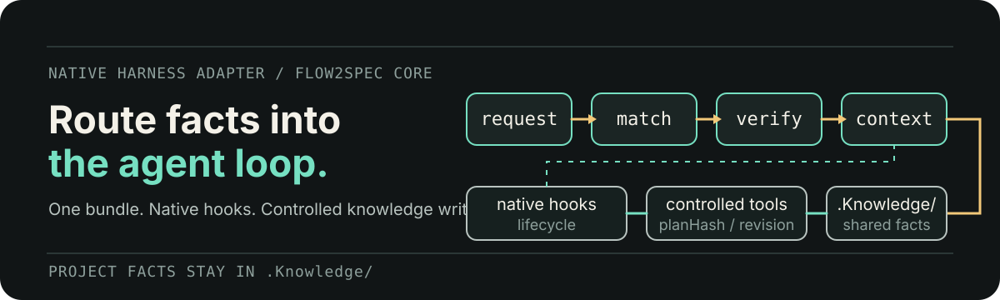
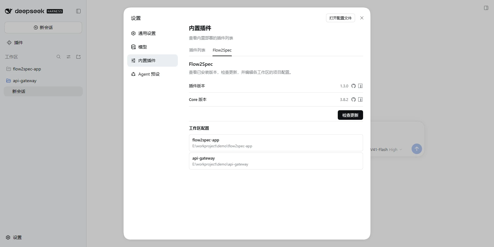

# Flow2Spec for DeepSeek Harness

<p align="center">
  
</p>

<p align="center">
  <strong>Bring Flow2Spec's spec-driven workflow and project knowledge routing into DeepSeek Harness.</strong>
</p>

<p align="center">
  <a href="./docs/README.zh-CN.md">中文</a> ·
  <a href="https://github.com/double-coding-lab/Flow2Spec">Flow2Spec</a> ·
  <a href="https://www.npmjs.com/package/@double-coding/flow2spec-deepseek-harness">npm</a>
</p>

<p align="center">
  <a href="https://www.npmjs.com/package/@double-coding/flow2spec-deepseek-harness"></a>
  <a href="https://github.com/double-coding-lab/Flow2Spec-DeepSeek-Harness/actions/workflows/ci.yml"></a>
  
  <a href="./LICENSE"></a>
</p>

This native plugin connects DeepSeek Harness to the same `.Knowledge/`, `f2s-*` skills, and project rules used by Flow2Spec. Each conversation can load the facts relevant to the current request instead of rediscovering the repository, while Cursor, Claude, Codex, and DeepSeek Harness continue to share one project knowledge base.

> This plugin follows DeepSeek Harness releases and keeps its integration aligned with the upstream runtime.

## Why this plugin

Flow2Spec already provides the knowledge model and spec-driven workflows. This package is the thin native adapter that makes those capabilities available inside DeepSeek Harness:

| Capability | What it adds to Harness |
| --- | --- |
| Project knowledge routing | Matches each request to compact topics in `.Knowledge/` before source exploration. |
| Native lifecycle integration | Loads Flow2Spec context through Cordis hooks without copying project skills into the profile. |
| Skill workflows | Exposes requirement clarification, technical design, implementation, fixes, knowledge sync, and commit workflows. |
| Controlled project tools | Provides status, routing, knowledge checks, initialization, and doctor operations. |
| Workspace settings card | Shows installed versions, checks for updates, and edits each workspace's `flow2spec.config.json`. |

Flow2Spec Core remains the single source of product behavior; this plugin only adapts it to the Harness runtime.

## Install

Requires Node.js `^22.19.0` or `>=24`.

Install the plugin into the profile you use. The Web profile is usually named `web`:

```bash
dsh plugin --profile web add @double-coding/flow2spec-deepseek-harness
dsh web
```

Use the **package name**, not a Git address. A Git install fetches the source tree, which carries no build output (`dist/`), and current pnpm refuses to run build scripts for git-hosted dependencies by default — the host then only reports `failed to import`. The registry tarball already ships `dist/`.

Open a project and start a conversation. The plugin incrementally adds `flow2spec.config.json` and the `.Knowledge/` skeleton when they are missing; existing project knowledge is preserved.

## Settings card

Open **Settings → Plugins → Flow2Spec** to manage the current workspace integration.

<p align="center">
  
</p>

The card provides:

- installed plugin and Flow2Spec Core versions;
- an explicit update check that reports availability without installing or restarting Harness;
- workspace search and selection;
- structured editing for the selected workspace's `flow2spec.config.json`;
- conflict-safe saves and project initialization confirmation.

Configuration is workspace-scoped. Changing a project here edits that project's file, not a global plugin preference.

## First use

Most of the time, describe the task in natural language. With intent recognition enabled, Flow2Spec can route the request into the appropriate workflow:

```text
Add batch recalculation. Retry failed items and never run the same batch twice.
```

You can also inspect or control the integration explicitly:

| Command | Purpose |
| --- | --- |
| `/flow2spec` / `status` | Show the current project and integration status. |
| `/flow2spec init` | Add missing project configuration and knowledge directories. |
| `/flow2spec doctor` | Diagnose the current integration. |
| `/flow2spec route <request>` | Preview the knowledge topics a request will load. |
| `/flow2spec kb check` | Validate the project knowledge base. |
| `/flow2spec kb build` | Rebuild knowledge routing, then validate it. |
| `/flow2spec update` | Check for available updates. |

The `f2s-*` skills remain available for explicit workflow selection.

## Workspace configuration

The project root `flow2spec.config.json` is the source of truth:

```json
{
  "locale": "en-US",
  "subAgent": true,
  "switchAgentVerification": true,
  "intentRecognition": true,
  "changeTracking": {
    "feat": true,
    "fix": false,
    "implement": true
  },
  "updateCheck": {
    "enabled": true
  },
  "collaboration": {
    "enabled": true,
    "developerId": ""
  }
}
```

| Field | Purpose |
| --- | --- |
| `locale` | Language used by Flow2Spec skills, rules, and generated project documents. |
| `subAgent` | Allows supported skills to delegate suitable subtasks. |
| `switchAgentVerification` | Enables cross-agent verification where a skill explicitly supports it. |
| `intentRecognition` | Routes natural-language requests into matching `f2s-*` workflows. |
| `changeTracking.*` | Selects which workflows maintain local `.task/` checklists. |
| `updateCheck.enabled` | Enables knowledge-template update checks. |
| `collaboration.enabled` | Separates local task state under `.task/<developerId>/`. |
| `collaboration.developerId` | Sets the local task directory identity; blank falls back to Git identity. |

Edits take effect the next time a Flow2Spec workflow runs. You can edit this file directly or use the workspace settings card.

## Existing Flow2Spec projects

Install the plugin and keep using the existing `.Knowledge/` and `flow2spec.config.json`.

Legacy project copies under `.dsh/skills/f2s-*` take precedence over bundled resources. `/flow2spec doctor` reports these overrides; the plugin does not delete user files.

## License

[MIT](./LICENSE)
