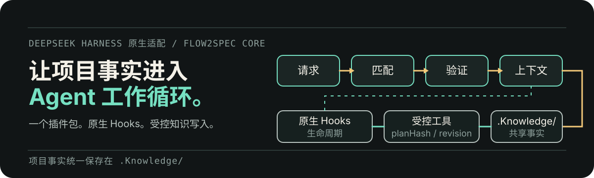

# Flow2Spec for DeepSeek Harness

<p align="center">
  
</p>

<p align="center">
  <strong>把 Flow2Spec 的 Spec-driven 工作流和项目知识路由带进 DeepSeek Harness。</strong>
</p>

<p align="center">
  <a href="../README.md">English</a> ·
  <a href="https://github.com/double-coding-lab/Flow2Spec">Flow2Spec</a> ·
  <a href="https://www.npmjs.com/package/@double-coding/flow2spec-deepseek-harness">npm</a>
</p>

<p align="center">
  <a href="https://www.npmjs.com/package/@double-coding/flow2spec-deepseek-harness"></a>
  <a href="https://github.com/double-coding-lab/Flow2Spec-DeepSeek-Harness/actions/workflows/ci.yml"></a>
  
  <a href="../LICENSE"></a>
</p>

这个原生插件把 DeepSeek Harness 接入 Flow2Spec 的 `.Knowledge/`、`f2s-*` 技能和项目规则。每次对话都可以先加载当前需求真正相关的项目事实，而不是重新翻完整个仓库；Cursor、Claude、Codex 和 DeepSeek Harness 也能继续共用同一份项目知识库。

> 本插件跟随 DeepSeek Harness 的版本持续适配，与上游运行时保持同步。

## 为什么需要这个插件

Flow2Spec 已经提供知识模型与 Spec-driven 工作流。这个包是一层轻量的原生适配，让这些能力直接进入 DeepSeek Harness：

| 能力 | 为 Harness 提供什么 |
| --- | --- |
| 项目知识路由 | 修改源码前，先把需求匹配到 `.Knowledge/` 中的紧凑 topics。 |
| 原生生命周期集成 | 通过 Cordis Hooks 加载 Flow2Spec 上下文，无需把项目技能复制到 profile。 |
| 技能工作流 | 提供需求澄清、技术方案、实现、修复、知识同步与提交等流程。 |
| 受控项目工具 | 提供状态、路由、知识校验、初始化与 Doctor 操作。 |
| 工作区设置卡片 | 查看安装版本、检查更新，并编辑每个工作区的 `flow2spec.config.json`。 |

Flow2Spec Core 是业务能力的唯一来源；这个插件只负责适配 Harness 运行时。

## 安装

需要 Node.js `^22.19.0` 或 `>=24`。

把插件装进要使用的 profile。Web profile 通常叫 `web`：

```bash
dsh plugin --profile web add @double-coding/flow2spec-deepseek-harness
dsh web
```

打开项目并开始一场对话。缺少配置时，插件会增量补齐 `flow2spec.config.json` 和 `.Knowledge/` 基础目录；已有项目知识不会被覆盖。

## 设置卡片

打开 **设置 → 插件 → Flow2Spec**，即可管理当前工作区的集成配置。

<p align="center">
  
</p>

卡片目前支持：

- 查看已安装的插件版本与 Flow2Spec Core 版本；
- 主动检查是否有新版本，只报告结果，不会在插件内安装或重启 Harness；
- 搜索和选择工作区；
- 用结构化表单编辑所选工作区的 `flow2spec.config.json`；
- 冲突安全保存，以及带确认步骤的项目初始化。

这些配置按工作区生效。修改卡片就是修改对应项目的配置文件，不是修改全局插件偏好。

## 第一次怎么用

大多数时候，直接用自然语言描述任务即可。开启意图识别后，Flow2Spec 可以自动把需求路由到合适的工作流：

```text
帮我新增批量重算功能，需要支持失败重试，并且不要重复执行同一批任务。
```

也可以通过命令显式查看或控制集成：

| 命令 | 用途 |
| --- | --- |
| `/flow2spec` / `status` | 查看当前项目与集成状态。 |
| `/flow2spec init` | 补齐缺少的项目配置和知识库目录。 |
| `/flow2spec doctor` | 诊断当前集成。 |
| `/flow2spec route <一句话>` | 预览这句话会加载哪些知识主题。 |
| `/flow2spec kb check` | 校验项目知识库。 |
| `/flow2spec kb build` | 重建知识路由后再校验。 |
| `/flow2spec update` | 检查可用更新。 |

需要明确指定流程时，仍然可以直接使用各个 `f2s-*` 技能。

## 工作区配置

项目根目录的 `flow2spec.config.json` 是配置事实源：

```json
{
  "locale": "zh-CN",
  "subAgent": true,
  "switchAgentVerification": true,
  "intentRecognition": true,
  "changeTracking": {
    "feat": true,
    "fix": false,
    "implement": true
  },
  "updateCheck": {
    "enabled": true
  },
  "collaboration": {
    "enabled": true,
    "developerId": ""
  }
}
```

| 字段 | 作用 |
| --- | --- |
| `locale` | Flow2Spec 技能、规则和生成项目文档使用的语言。 |
| `subAgent` | 允许支持该能力的技能拆分适合的子任务。 |
| `switchAgentVerification` | 在技能明确支持时启用跨 Agent 校验。 |
| `intentRecognition` | 根据自然语言需求进入匹配的 `f2s-*` 工作流。 |
| `changeTracking.*` | 决定哪些流程维护本地 `.task/` 清单。 |
| `updateCheck.enabled` | 是否检查知识库模板更新。 |
| `collaboration.enabled` | 是否把本地任务状态拆分到 `.task/<developerId>/`。 |
| `collaboration.developerId` | 本地任务目录身份；留空时回退到 Git 身份。 |

保存后，下次执行 Flow2Spec 工作流时生效。你可以直接编辑文件，也可以使用工作区设置卡片。

## 已经在使用 Flow2Spec 的项目

直接安装插件，原有 `.Knowledge/` 和 `flow2spec.config.json` 会继续复用。

项目里旧有的 `.dsh/skills/f2s-*` 副本优先于插件内置资源。`/flow2spec doctor` 会报告这些覆盖项；插件不会擅自删除用户文件。

## 协议

[MIT](../LICENSE)
